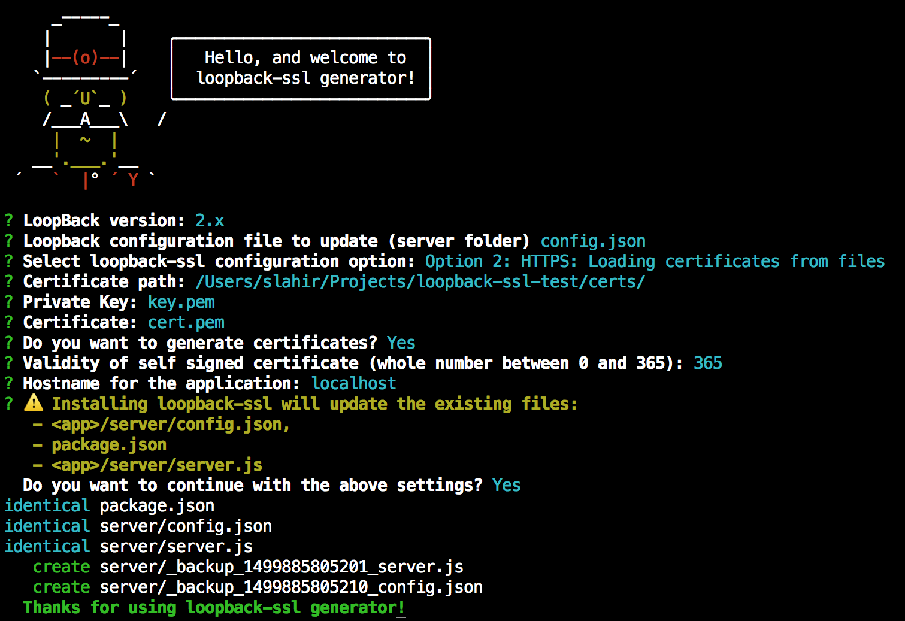

# loopback-ssl

Node module to enable HTTPS/SSL in a [loopback] application with simple configurations. The module also enables trusted peer authentication.

[](https://img.shields.io/travis/yantrashala/loopback-ssl/master.svg) [](https://nodei.co/npm/loopback-ssl/) [](https://nodei.co/npm/loopback-ssl/) [](https://github.com/yantrashala/loopback-ssl) [](https://www.npmjs.com/package/loopback-ssl) [](https://www.npmjs.com/package/loopback-ssl) [](https://www.codacy.com/app/siddhartha-lahiri/loopback-ssl?utm_source=github.com&amp;utm_medium=referral&amp;utm_content=yantrashala/loopback-ssl&amp;utm_campaign=Badge_Grade) [](https://www.codacy.com/app/siddhartha-lahiri/loopback-ssl?utm_source=github.com&amp;utm_medium=referral&amp;utm_content=yantrashala/loopback-ssl&amp;utm_campaign=Badge_Coverage) [](https://codecov.io/gh/yantrashala/loopback-ssl) [](https://gitter.im/yantrashala/loopback-ssl?utm_source=badge&utm_medium=badge&utm_campaign=pr-badge&utm_content=badge)


# Features
- Enable SSL in Loopback application
- Enable mutual SSL authentication in Loopback

# Setup

## Wizard based setup
Install loopback using yeoman generator [generator-loopback-ssl](https://www.npmjs.com/package/generator-loopback-ssl)

```bash
npm install -g yo
npm install -g generator-loopback-ssl
```

Install loopback

```bash

# install loopback-cli
npm install -g loopback-cli

# create project directory
mkdir <app-name>
cd <app-name>

# create loopback application
lb
# ? What's the name of your application? <app-name>
# ? Which version of LoopBack would you like to use? 3.x (current)
# ? What kind of application do you have in mind? notes
```

Install loopback-ssl

```bash
yo loopback-ssl
```

### Example



## Manual Setup
Install loopback-ssl via manual configuration

### Install [loopback]:
```bash

# install loopback-cli
npm install -g loopback-cli

# create project directory
mkdir <app-name>
cd <app-name>

# create loopback application
lb
# ? What's the name of your application? <app-name>
# ? Which version of LoopBack would you like to use? 3.x (current)
# ? What kind of application do you have in mind? notes
```

### Install [loopback-ssl]:
```js
npm install loopback-ssl --save
```

### Setup Configuration:
Add the following lines of configuration in 'config.json' in location "\<app-dir\>/server/config.json"
```js
  "httpMode": false,
  "certConfig": {
    "path": "/certificate/path/",
    "key": "local.pem",
    "cert": "local.crt.pem",
    "ca": [],
    "requestCert": false,
    "rejectUnauthorized": false
  }
```

### Configure server.js
Edit the server.js located at "\<app-dir\>/server/server.js". Replace the code in server.js with the code below (assuming no prior customizations to the file)

#### server.js
```js
var loopback = require('loopback');
var boot = require('loopback-boot');
var loopbackSSL = require('loopback-ssl');

var app = module.exports = loopback();

boot(app, __dirname, function(err) {
  if (err) throw err;
});

return loopbackSSL.startServer(app);
```
## Configuration options

### Option 1: HTTP (default loopback configuration)
The configuration entry `"httpMode": true` will enable http (disable https). In this mode the `"certConfig": {..}` configuration is not required and can be omitted.
```js
  "httpMode": true
```

### Option 2: HTTPS: Loading certificates from files
The configuration entry `"httpMode": false` will enable https.
```js
  "httpMode": false,
  "certConfig": {
    "path": "/certificate/path/",
    "key": "serverkey.pem",
    "cert": "server-certificate.pem",
    "ca": [],
    "requestCert": false,
    "rejectUnauthorized": false
  }
```
- `"path"` - folder location where the certificates files will be installed
- `"key"` - server key
- `"cert"` - server certificate

### Option 3: HTTPS: Loading certificates from files & Mutual SSL authentication
Will only work with pre-generated certificate files
```js
  "httpMode": false,
  "certConfig": {
    "path": "/certificate/path/",
    "key": "serverkey.pem",
    "cert": "server-certificate.pem",
    "ca": [
        "client-certificate-to-validate.pem"
    ],
    "requestCert": true,
    "rejectUnauthorized": true
  }
```
- The `ca[]` configuration contains the list of client certificates which the server will authenticate
- `"requestCert": true` enables mutual SSL authentication
- `"rejectUnauthorized": true` enables the authenticity and validity check of client keys
- For any reason, if the client certificate is a self signed certificate, `"rejectUnauthorized":` can be set to `false`.


# Contributing

- Want to contribute? Great! Please check this [guide](https://github.com/yantrashala/loopback-ssl/blob/master/CONTRIBUTING.md).
- Fork it ( https://github.com/yantrashala/loopback-ssl/fork )
- Create your feature branch (git checkout -b new-feature)
- Commit your changes (git commit -am 'Add some feature')
- Push to the branch (git push origin new-feature)
- Create new Pull Request

# License

[MIT](./LICENSE).

# See Also
- [Self Signed Certificates - Example][self_signed]

[loopback]: http://loopback.io
[loopback-ssl]: https://www.npmjs.com/package/loopback-ssl
[trusted_peer]: https://github.com/coolaj86/nodejs-ssl-trusted-peer-example
[self_signed]: https://github.com/coolaj86/nodejs-self-signed-certificate-example
